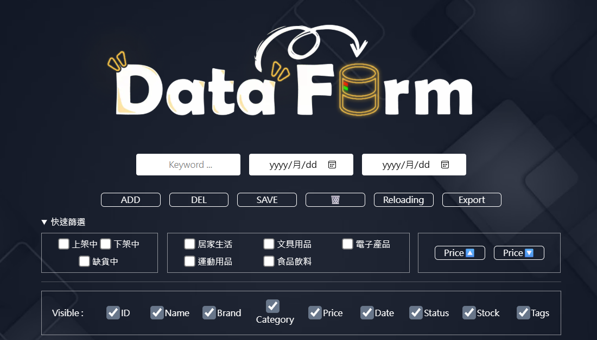
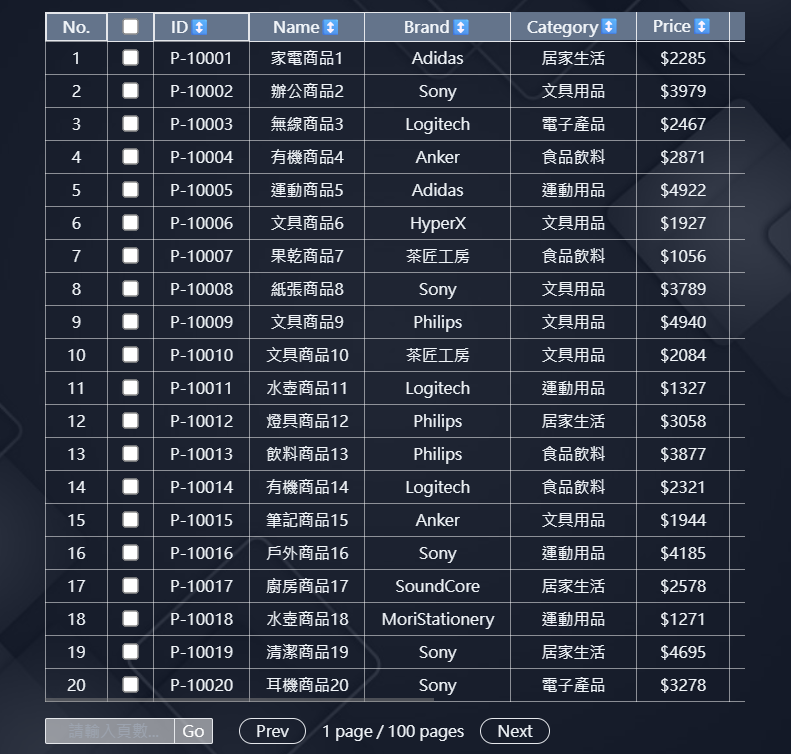
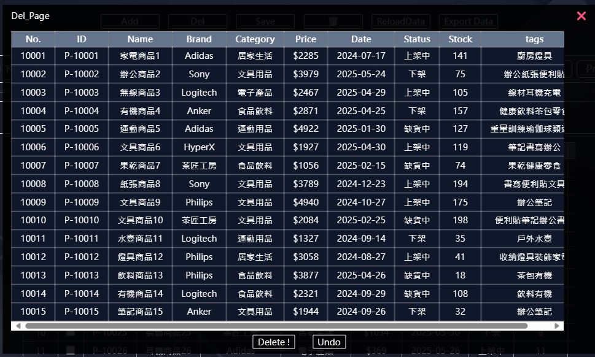
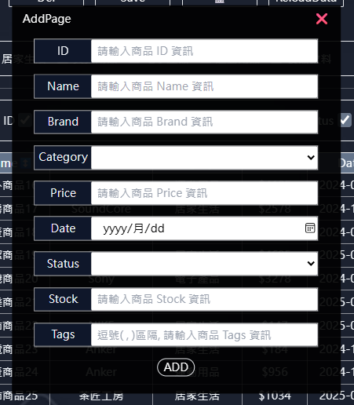

# DataForm - JSON 表單工具

這是一個使用 React 打造的表單工具，使用者可以自由新增與修改欄位，管理資料內容，並將結果匯出成 JSON 格式。

> 此專案為個人練習作品之一，主要練習 React、狀態管理、資料輸出與 localStorage 資料儲存等功能。

---

## 📷 專案畫面

---

## 功能特色

- **動態新增欄位**
- **即時編輯 key / value 值**
- **可刪除任意一組資料**
- **資料會保存在 localStorage 中**
- **一鍵匯出 JSON**

---

## 技術使用

| 技術         | 說明                               |
| ------------ | ---------------------------------- |
| React        | 使用 `useReducer` 處理表單資料邏輯 |
| Context API  | 全域狀態管理（資料與操作共用）     |
| localStorage | 儲存使用者填寫的資料內容           |
| JSON 處理    | `JSON.stringify()` 輸出匯出格式    |
| Tailwind CSS | UI 排版與互動優化                  |

---
